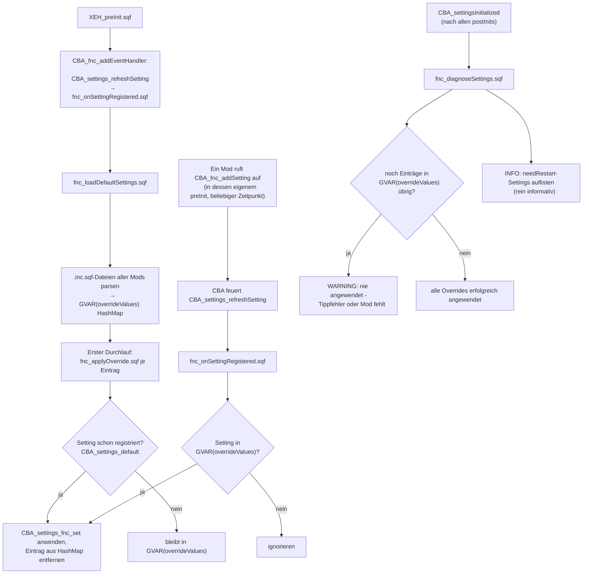

# Settings

Stark inspiriert von <https://gitlab.gruppe-w.de/Missionsbau/Framework/-/tree/master/addons/ace?ref_type=heads>

## Funktionsweise

`fnc_loadDefaultSettings.sqf` liest pro Mod eine `settings/<Mod>.inc.sqf`-Datei (DSL mit `force x = y;` / `force force x = y;` / `x = y;`, geparst über `CBA_settings_fnc_parse`) und erzwingt die enthaltenen Werte per `CBA_settings_fnc_set`.

### Ladereihenfolge-Problem (preInit vs. postInit)

`CBA_settings_fnc_set` prüft den Werttyp gegen die von `CBA_fnc_addSetting` hinterlegten Metadaten - ist eine Einstellung noch nicht registriert, schlägt dieser Check kommentarlos fehl. Früher wurde deshalb erst nach dem `CBA_settingsInitialized`-Event geladen. Das Event feuert allerdings erst, nachdem **alle** Addons ihr `postInit` bereits durchlaufen haben - für jede Einstellung, die ein Mod einmalig in seinem eigenen `postInit` ausliest und cached (typischerweise die von CBA selbst als `needRestart` markierten), kam der erzwungene Wert damit zu spät an.

Die Lösung: `CBA_fnc_addSetting` feuert am Ende jeder Registrierung intern das Event `CBA_settings_refreshSetting` mit dem Namen der Einstellung - unabhängig vom `needRestart`-Flag, das nur ein reiner UI-Hinweis im Einstellungsmenü ist und die Live-Übernahme nicht blockiert. `fnc_loadDefaultSettings.sqf` sammelt alle zu erzwingenden Werte in `GVAR(overrideValues)` (HashMap), wendet sie sofort an, wo die Einstellung schon registriert ist, und `fnc_onSettingRegistered.sqf` hört auf `CBA_settings_refreshSetting`, um den Rest anzuwenden, sobald sie registriert werden (`fnc_applyOverride.sqf`, gemeinsam für beide Pfade). Da jede Registrierung zwingend im `preInit` irgendeines Addons passiert und alle `preInit`s vor jedem `postInit` abgeschlossen sind, landet der erzwungene Wert so garantiert vor dem ersten `postInit`-Zugriff - unabhängig von der tatsächlichen Ladereihenfolge der Mods untereinander.

`fnc_diagnoseSettings.sqf` läuft am `CBA_settingsInitialized`-Event und schreibt zwei Prüfungen ins RPT:

- **`WARNING`**: Einstellungen aus den `.inc.sqf`-Dateien, die nie registriert wurden (Tippfehler im Namen oder der Mod ist nicht geladen) - das ist tatsächlich handlungsrelevant.
- **`INFO`**: Übersicht der erzwungenen Einstellungen, die CBA selbst als `needRestart` markiert - rein informativ, da diese durch den Mechanismus oben bereits korrekt früh angewendet werden.

### Ablauf

## Maintainer

- Andx
